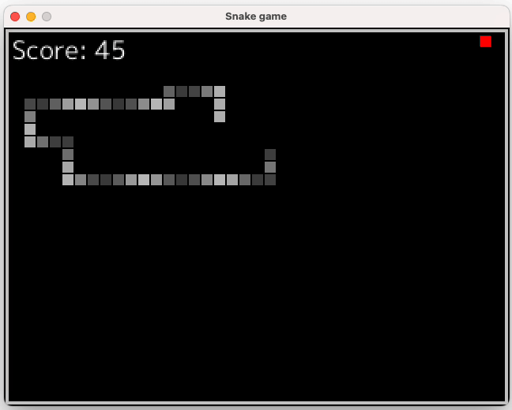

# Playing with ebitengine

* https://ebitengine.org/en/documents/cheatsheet.html#Overview
* https://ebitengine.org/en/examples/
* https://pkg.go.dev/github.com/hajimehoshi/ebiten/v2

# Snake

Something to get started...

